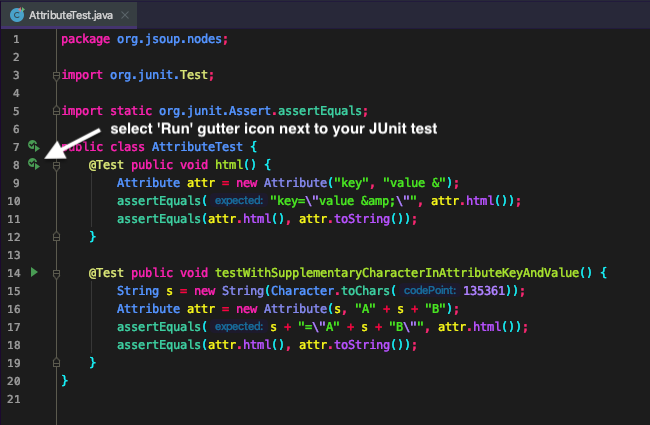
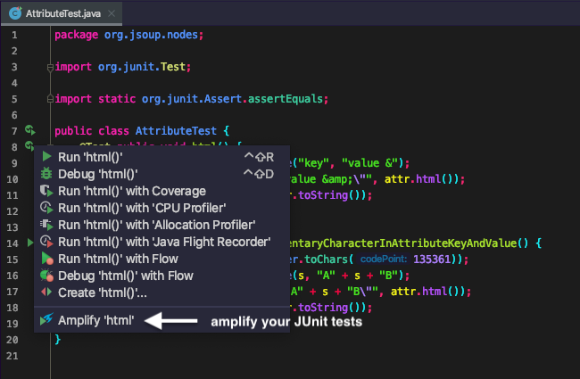
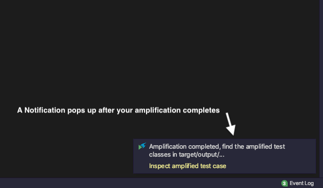

# Welcome to Test Cube!
**The IntelliJ Plugin to help you automatically make your test suite better**

<!-- todo: Amplify: link to explanation? paper? -->
Test Cube *amplifies* your JUnit tests right from your IDE.

This plugin can help you automatically amplify your JUnit tests to improve your test suite 😊  
The heart of our amplification is [DSpot](https://github.com/STAMP-project/dspot). 
To be able to use Test Cube / DSpot your project needs to be based on Java 8 and be built with Maven.

You need the path to your Java 8 home (e.g. `/Library/Java/JavaVirtualMachines/adoptopenjdk-8.jdk/Contents/Home`) and the path to your Maven Home (e.g. `/usr/local/Cellar/maven/3.6.3_1/libexec`).
The first time you're using Test Cube you will be asked for these two 🙂.

Find out more about our research project and how we want to help developers improve their test suites on the [TestShift project website](https://testshiftproject.github.io/visualizing-amplification).

## Install Test Cube

### JetBrains Marketplace
To install from the JetBrains Marketplace follow this link: https://plugins.jetbrains.com/plugin/14678-test-cube
Or search for "Test Cube" in IntelliJ "Preferences" > "Plugins" > "Marketplace". Make sure to install version `0.1.1-SNAPSHOT` or later 🙂

## Usage

